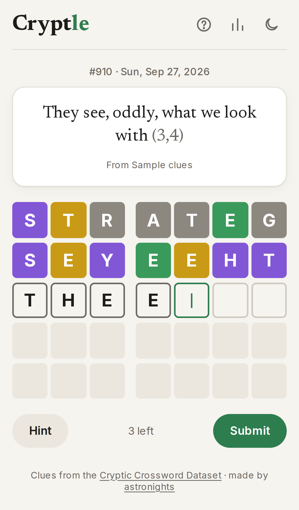

# Cryptle

A daily Cryptic Crossword challenge inspired from Wordle. The site is live at [Cryptle](https://daily-cryptic-iief.vercel.app/)


## Technology

The project is created with the following stack:

- TypeScript
- Next.js (App Router, server actions)
- React
- MongoDB
- Vercel

If you would like to run the project yourself:

```bash
npm install
npm run dev     # uses built-in sample clues when MONGO_URI is not set
npm test        # scoring / date unit tests
```

Set `MONGO_URI` to play with the real clue database.

### How it works

- `src/app/actions.ts`: server actions: load the day's puzzle, reveal the hint, rate a clue.
- `src/lib/clues.ts`: clue storage (MongoDB, or sample clues for local dev). Each day's clue is assigned once, and assignment is safe when two requests arrive together.
- `src/lib/score.ts`: guess scoring, shared by the game and the How to play examples.
- `src/components/Game.tsx`: the single-screen game UI. Progress and stats are kept in `localStorage`.



Open [http://localhost:3000](http://localhost:3000) with your browser to see the result.

## Data

A publicly available dataset has been sourced to get cryptic crossword clues over the last decade, to which I express my gratitude.

- [Cryptic Data](https://cryptics.georgeho.org/) - Cryptic clues and answers.
